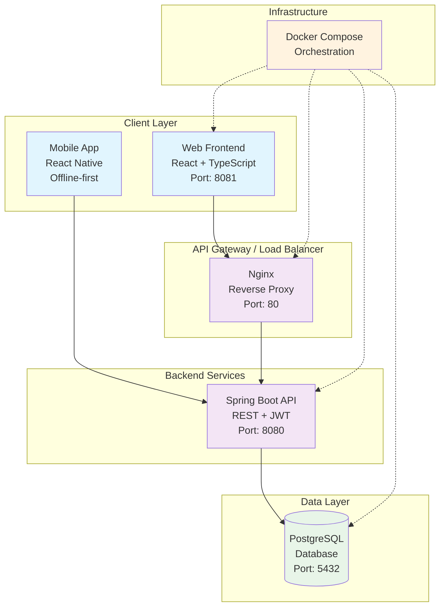
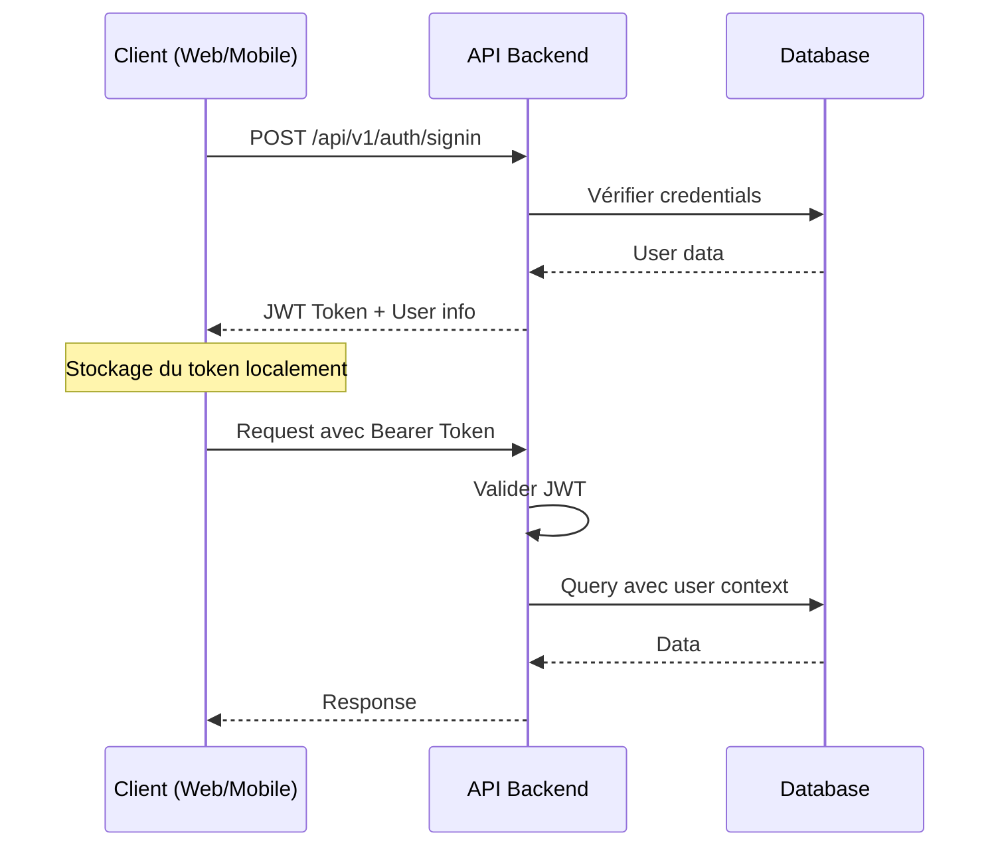
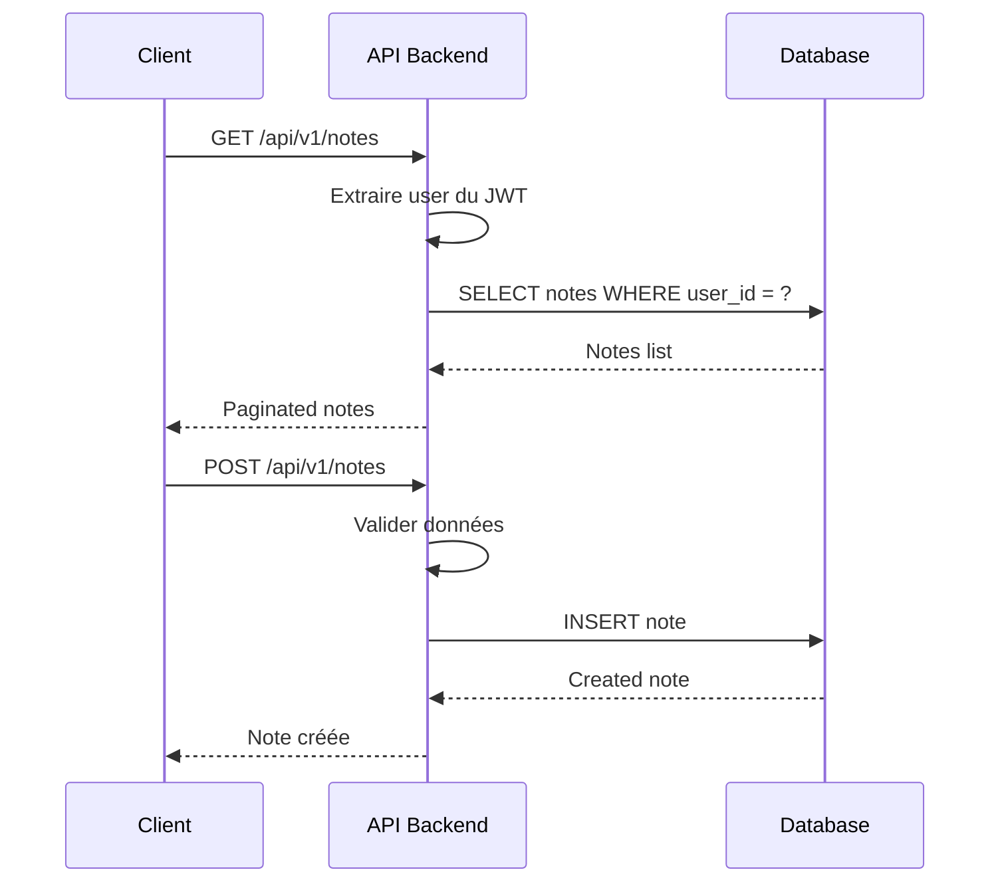
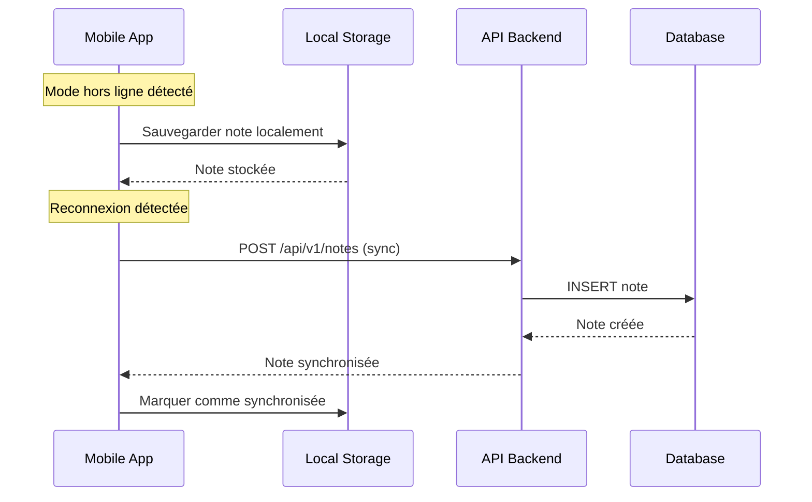

# Architecture Notes Suite

## Vue d'ensemble

Notes Suite est une application de gestion de notes collaboratives composée de trois couches principales :

- **Backend** : API REST Spring Boot 3 avec authentification JWT
- **Frontend Web** : Application React TypeScript moderne
- **Mobile** : Application React Native offline-first

## Schéma d'architecture



## Interactions entre les couches

### 1. Authentification et Autorisation



### 2. Gestion des Notes



### 3. Mode Offline (Mobile)



## Technologies utilisées

### Backend (Spring Boot 3)
- **Framework** : Spring Boot 3.2.0
- **Base de données** : PostgreSQL 15
- **Sécurité** : Spring Security + JWT
- **ORM** : Spring Data JPA + Hibernate
- **Validation** : Bean Validation
- **Documentation** : Spring Boot Actuator

### Frontend Web (React)
- **Framework** : React 18 + TypeScript
- **UI Library** : Material-UI (MUI)
- **Routing** : React Router v6
- **State Management** : React Query
- **Forms** : React Hook Form + Yup
- **HTTP Client** : Axios

### Mobile (React Native)
- **Framework** : React Native 0.72
- **UI Library** : React Native Paper
- **Navigation** : React Navigation v6
- **State Management** : React Query
- **Offline Storage** : AsyncStorage
- **Network** : NetInfo + Axios

### Infrastructure
- **Containerisation** : Docker + Docker Compose
- **Base de données** : PostgreSQL 15 Alpine
- **Reverse Proxy** : Nginx (optionnel)
- **Orchestration** : Docker Compose

## Flux de données

### 1. Création d'une note

1. **Client** → Saisie des données
2. **Validation** → Côté client (React Hook Form + Yup)
3. **API Call** → POST /api/v1/notes
4. **Authentification** → Vérification JWT
5. **Validation** → Côté serveur (Bean Validation)
6. **Persistence** → Sauvegarde en base
7. **Response** → Retour de la note créée

### 2. Synchronisation offline (Mobile)

1. **Détection** → Perte de connexion
2. **Stockage local** → AsyncStorage
3. **Marquage** → Note en attente de sync
4. **Reconnexion** → Détection automatique
5. **Synchronisation** → Envoi des notes en attente
6. **Mise à jour** → Statut de synchronisation

## Sécurité

### Authentification
- **JWT Tokens** avec expiration configurable
- **Refresh tokens** (optionnel)
- **Hachage des mots de passe** avec BCrypt

### Autorisation
- **RBAC** (Role-Based Access Control)
- **Rôles** : USER, ADMIN
- **Permissions** : Lecture/Écriture basées sur la propriété

### Protection des données
- **CORS** configuré pour les domaines autorisés
- **Validation** des entrées côté client et serveur
- **Sanitisation** des données avant stockage

## Déploiement

### Développement
```bash
# Backend + Web + Database
docker compose up -d

# Mobile (séparément)
cd mobile-app
npm install
npx react-native run-android
```

### Production
- **Backend** : Conteneurisé avec Docker
- **Frontend** : Build statique avec Nginx
- **Mobile** : Build natif (APK/IPA)
- **Database** : PostgreSQL avec persistence

## Monitoring et Observabilité

- **Health Checks** : Spring Boot Actuator
- **Logs** : Structured logging avec SLF4J
- **Metrics** : Micrometer (optionnel)
- **Error Handling** : Global exception handlers

## Évolutivité

### Horizontal Scaling
- **API** : Stateless, scalable horizontalement
- **Database** : Read replicas pour les requêtes de lecture
- **Load Balancer** : Nginx pour la distribution de charge

### Vertical Scaling
- **Resources** : Configuration via Docker Compose
- **Database** : Optimisation des index et requêtes
- **Caching** : Redis (optionnel pour les sessions)
