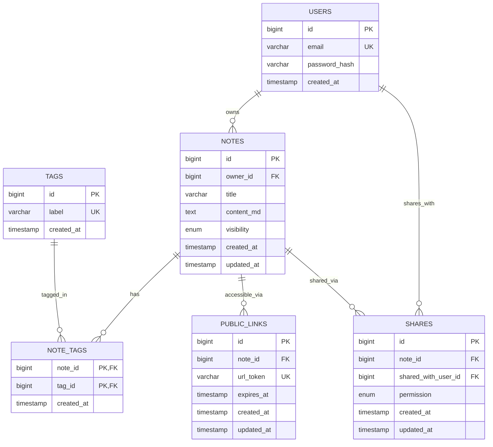

# Diagramme ERD - Notes Suite

## Modèle de données complet



## Description des entités

### USERS
- **id** : Identifiant unique (clé primaire)
- **email** : Adresse email unique de l'utilisateur
- **password_hash** : Hash du mot de passe (BCrypt)
- **created_at** : Date de création du compte

### NOTES
- **id** : Identifiant unique (clé primaire)
- **owner_id** : Référence vers l'utilisateur propriétaire
- **title** : Titre de la note (max 500 caractères)
- **content_md** : Contenu en Markdown
- **visibility** : Visibilité (PRIVATE, SHARED, PUBLIC)
- **created_at** : Date de création
- **updated_at** : Date de dernière modification

### TAGS
- **id** : Identifiant unique (clé primaire)
- **label** : Libellé du tag (unique, format alphanumérique)
- **created_at** : Date de création

### NOTE_TAGS
- **note_id** : Référence vers la note
- **tag_id** : Référence vers le tag
- **created_at** : Date d'association
- Clé primaire composite (note_id, tag_id)

### SHARES
- **id** : Identifiant unique (clé primaire)
- **note_id** : Référence vers la note partagée
- **shared_with_user_id** : Référence vers l'utilisateur avec qui partager
- **permission** : Type de permission (READ, WRITE, ADMIN)
- **created_at** : Date de partage
- **updated_at** : Date de dernière modification

### PUBLIC_LINKS
- **id** : Identifiant unique (clé primaire)
- **note_id** : Référence vers la note
- **url_token** : Token unique pour l'accès public
- **expires_at** : Date d'expiration (optionnelle)
- **created_at** : Date de création du lien
- **updated_at** : Date de dernière modification

## Types énumérés

### note_visibility
- **PRIVATE** : Note privée, visible uniquement par le propriétaire
- **SHARED** : Note partagée avec des utilisateurs spécifiques
- **PUBLIC** : Note publique, visible par tous

### share_permission
- **READ** : Permission de lecture uniquement
- **WRITE** : Permission de lecture et écriture
- **ADMIN** : Permission complète (lecture, écriture, suppression, partage)

## Contraintes et règles métier

### Contraintes d'intégrité
1. **Cascade Delete** : Suppression en cascade des notes et de leurs relations
2. **Unique Constraints** : Email unique, label de tag unique, token URL unique
3. **Check Constraints** : Validation des formats (email, token, longueurs)

### Règles métier
1. **Auto-partage impossible** : Un utilisateur ne peut pas partager une note avec lui-même
2. **Partage unique** : Un utilisateur ne peut avoir qu'un seul type de permission par note
3. **Token sécurisé** : Les tokens URL sont générés de manière cryptographiquement sécurisée
4. **Expiration optionnelle** : Les liens publics peuvent avoir une date d'expiration

## Index et performances

### Index principaux
- **Recherche textuelle** : Index GIN sur title et content_md pour la recherche full-text
- **Requêtes fréquentes** : Index sur owner_id, visibility, created_at
- **Relations** : Index sur toutes les clés étrangères

### Optimisations
- **Triggers** : Mise à jour automatique de updated_at
- **Vues** : Vue user_accessible_notes pour simplifier les requêtes d'accès
- **Fonctions** : Fonctions utilitaires pour la génération de tokens et validation

## Exemples d'utilisation

### Créer une note privée
```sql
INSERT INTO notes (owner_id, title, content_md, visibility) 
VALUES (1, 'Ma note privée', '# Contenu', 'PRIVATE');
```

### Partager une note
```sql
INSERT INTO shares (note_id, shared_with_user_id, permission) 
VALUES (1, 2, 'READ');
```

### Créer un lien public temporaire
```sql
INSERT INTO public_links (note_id, url_token, expires_at) 
VALUES (1, generate_url_token(), CURRENT_TIMESTAMP + INTERVAL '7 days');
```

### Rechercher des notes accessibles
```sql
SELECT * FROM user_accessible_notes WHERE access_level != 'NONE';
```


